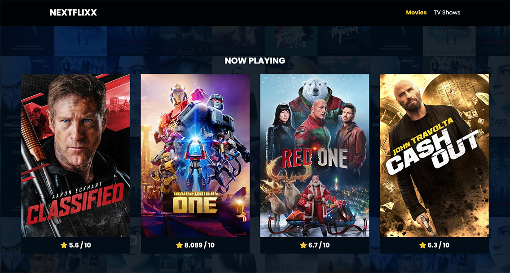

# NEXTFlixx App

A dynamic, responsive movie and TV show application designed for exploring popular titles, browsing detailed information, and delivering an engaging user experience. The project combines a sleek front-end interface with a secure Node.js and Express backend, fetching data in real-time from The Movie Database (TMDB) API.

## View the Project

- **Live Demo**: [NEXTFlixx App](https://nextflixx-app.vercel.app/)

## Key Features

- **Dynamic API Integration**: Real-time data fetched from the TMDB API for movies and TV shows.
- **Responsive Design**: Optimized for desktops, tablets, and mobile devices using CSS grid and flexbox.
- **Interactive Elements**: Includes hover effects, dynamic content loading, and modals for user interactions.
- **Search Functionality**: Allows users to search for movies and TV shows by title.
- **Detailed Information Pages**: Provides ratings, genres, release dates, and synopsis for each movie or TV show.
- **Secure Proxy Server**: Uses an Express-based server to protect API keys and handle requests securely.
- **Loading Spinner Animation**: Displays a spinner during API requests for enhanced user feedback.

## Technologies Used

### Front-End
- **HTML5 & CSS3**: For structuring and styling the application.
- **JavaScript (ES6+)**: Core scripting for dynamic features and API integration.
- **Font Awesome**: Adds icons for visual enhancement.
- **Responsive Design**: Ensures optimal display on all device sizes.

### Back-End
- **Node.js**: JavaScript runtime for the server-side application.
- **Express.js**: Framework for building the API proxy server.
- **Dotenv**: Manages sensitive environment variables like the TMDB API key.

## How It Works

1. **Browse Popular Movies and TV Shows**  
   - Users can view the 20 most popular movies and TV shows directly on the homepage, fetched in real-time from TMDB.

2. **Search for Titles**  
   - The search bar allows users to look up movies or TV shows by name.

3. **Explore Details**  
   - Clicking on a movie or TV show redirects to a detailed page, showing:
     - Ratings
     - Genres
     - Release or air dates
     - Overview and synopsis

4. **Security and Performance**  
   - All API requests are routed through a secure Express proxy server, ensuring sensitive API keys remain hidden.

## Future Enhancements

- **User Authentication**: Add personalized features like watchlists.
- **Pagination**: Browse through larger datasets efficiently.
- **Advanced Filters**: Refine searches by genre, release year, or ratings.

## Contact

- **Cynthia Carter**  
  - **GitHub**: [legendaryminds](https://github.com/legendaryminds)  
  - **Email**: *cynthianicolecarter369@gmail.com*

